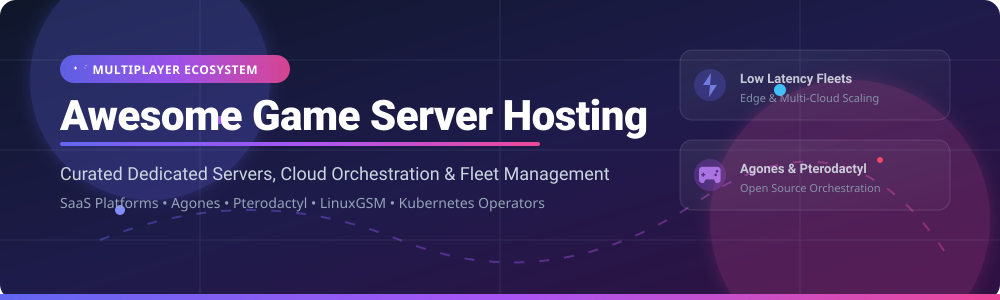

# 🎮 Awesome Game Server Hosting 🚀

<p align="center">
  <a href="https://github.com/ishandutta2007/Awesome-Awesome-Awesome"></a><a href="https://discord.gg/jc4xtF58Ve"></a>
  <a href="https://github.com/ishandutta2007/Awesome-Game-Server-Hosting/stargazers"></a>
  <a href="https://github.com/ishandutta2007/Awesome-Game-Server-Hosting/network/members"></a>
  <a href="https://github.com/ishandutta2007/Awesome-Game-Server-Hosting/blob/main/LICENSE"></a>
  <a href="https://github.com/ishandutta2007"></a>
</p>



## 📌 Top Game Server Hosting Platforms & Orchestration Ecosystem

> A curated list of production-ready **SaaS Game Server Hosting Platforms**, **Edge Orchestrators**, and **Open-Source Dedicated Game Server Managers** (Agones, Pterodactyl, LinuxGSM, Nakama).

**Last updated:** September 2026

---

### 🔍 Overview & SEO Keywords
This repository provides a comprehensive index of enterprise **game server hosting**, **multiplayer backend infrastructure**, **session allocation**, **match-ready fleet autoscaling**, and **edge server orchestration**. Whether you are building an indie multiplayer game with Unreal Engine/Unity, operating low-latency competitive AAA fleets, or self-hosting community dedicated servers (Minecraft, Source, Rust), this guide covers leading managed platforms and open-source frameworks.

---

## 📚 Table of Contents

- [🌐 SaaS / Managed Hosting Platforms](#-saas--managed-hosting-platforms)
- [💻 Open-Source GitHub Projects](#-open-source-github-projects)
- [🏗️ Architecture & Deployment Frameworks](#%EF%B8%8F-architecture--deployment-frameworks)
- [🤝 How to Contribute](#-how-to-contribute)
- [📈 Star History](#-star-history)
- [💖 Support & Community](#-support--community)
- [⚠️ Disclaimer](#%EF%B8%8F-disclaimer)

---

## 🌐 SaaS / Managed Hosting Platforms

> **📊 Market Size & Sector Dynamics:**  
> The global multiplayer game server hosting & orchestration market is estimated at **~$1.8 Billion (2026)** and is projected to expand to **~$3.5 Billion by 2030** (CAGR ~15%). The market is **moderately fragmented**: hyperscale cloud platforms (Amazon GameLift, Unity Multiplay) dominate large-scale studio fleets, while specialized low-latency edge orchestrators (Edgegap, Gameye) and dedicated community server hosts (BisectHosting, Shockbyte) capture specialized indie and community segments.

The table below lists top managed SaaS game server hosting providers sorted by **Company Size / Revenue / Valuation (Descending)**:

| 🏢 Platform / Provider | 📝 Description & Features | 💰 Specific Starting Pricing | 🎁 Free Tier / Free Trial Limits | 📊 Company Scale / Valuation |
| :--- | :--- | :--- | :--- | :--- |
| **[Amazon GameLift](https://aws.amazon.com/gamelift/)** | Fully managed AWS game server deployment, autoscaling, session placement, queues, and matchmaking integration. | **$0.054/hour** per server instance + standard AWS EC2 compute rates. | **125 hours/month** of c4.large instance + 50 GB storage (AWS Free Tier for 12 months). | **Revenue: $575B+** *(Amazon AWS Enterprise Leader)* |
| **[Unity Multiplay](https://unity.com/)** | Studio-grade dedicated game server orchestration, dynamic global scaling, and hybrid bare-metal/cloud fleets. | **$0.02 to $0.08/core hour** + bandwidth ($0.09/GB). | **$100 free monthly credit** (~5,000 player hours/month for new projects). | **Revenue: $2.1B+** *(Publicly Traded U)* |
| **[OVHcloud Game](https://www.ovhcloud.com/)** | Anti-DDoS protected dedicated bare-metal game servers optimized for high-frequency multiplayer workloads. | **$54.99/month** per dedicated server instance. | **7-day money-back guarantee** *(No permanent free tier)*. | **Revenue: $950M+** *(Publicly Traded OVH)* |
| **[Heroic Labs / Heroic Cloud](https://heroiclabs.com/)** | Managed enterprise cloud infrastructure for Nakama backend, session storage, and multiplayer matchmaking fleets. | **$600/month** for managed dedicated production cluster. | **14-day free trial** on Heroic Cloud development clusters. | **Valuation: ~$50M+** *(Mid-Market Leader)* |
| **[BisectHosting](https://www.bisecthosting.com/)** | High-performance community and small-studio multiplayer server hosting across 100+ titles with custom control panel. | **$2.99/month** (Budget 1GB RAM) up to **$7.98/month** (Premium). | **3-day money-back guarantee** *(No permanent free tier)*. | **Revenue: ~$25M ARR** *(High-Volume Host)* |
| **[Edgegap](https://edgegap.com/)** | Automated containerized game server deployment operating across 550+ global edge locations for sub-50ms latency. | **$0.012/hour** ($0.0002/minute) per active game server container. | **Free Forever Tier**: **$10 free monthly credit** (~800 server hours/month). | **Valuation: ~$15M** *(Series A VC Backed)* |
| **[Shockbyte](https://shockbyte.com/)** | Indie and community game server hosting with instant setup, full FTP access, and automated modpack installers. | **$2.50/month** (1GB RAM entry plan). | **24-hour full refund period** *(No permanent free tier)*. | **Revenue: ~$15M ARR** *(High-Volume Host)* |
| **[Gameye](https://gameye.com/)** | Multi-provider game server orchestration API allocating instant capacity across top bare-metal and cloud hosts. | **€0.015/hour** (~$0.016/hr) per core hour. | **14-day free trial** with 100 free server execution hours. | **Valuation: ~$10M** *(Growth Stage VC)* |

---

## 💻 Open-Source GitHub Projects

Below are open-source dedicated server managers, Kubernetes operators, matchmakers, and container templates sorted by **GitHub Star Count (Descending)**:

1. **[Nakama](https://github.com/heroiclabs/nakama)** [](https://github.com/heroiclabs/nakama/stargazers)  
   *Distributed open-source server for social and real-time competitive games. Handles sessions, matchmaking, turn-based gameplay, and storage.*

2. **[Agones](https://github.com/googleforgames/agones)** [](https://github.com/googleforgames/agones/stargazers)  
   *Google & EA founded open-source platform for hosting, scaling, and orchestrating dedicated game servers on Kubernetes via custom CRDs.*

3. **[Pterodactyl Panel](https://github.com/pterodactyl/panel)** [](https://github.com/pterodactyl/panel/stargazers)  
   *Free, open-source game server management panel built with PHP, React, and Docker. Supports Minecraft, Source Engine, Rust, and custom binaries.*

4. **[docker-minecraft-server](https://github.com/itzg/docker-minecraft-server)** [](https://github.com/itzg/docker-minecraft-server/stargazers)  
   *Enterprise-grade Docker image for Minecraft servers with automatic modpack downloading, forge/fabric integration, and health checks.*

5. **[LinuxGSM (Linux Game Server Managers)](https://github.com/GameServerManagers/LinuxGSM)** [](https://github.com/GameServerManagers/LinuxGSM/stargazers)  
   *Command-line utility for quick deployment, monitoring, and administration of over 120+ dedicated Linux game servers.*

6. **[Open Match](https://github.com/googleforgames/open-match)** [](https://github.com/googleforgames/open-match/stargazers)  
   *Flexible open-source matchmaking framework designed to pair with Agones and Kubernetes dedicated game fleets.*

7. **[Pterodactyl Wings](https://github.com/pterodactyl/wings)** [](https://github.com/pterodactyl/wings/stargazers)  
   *High-performance Go-based server daemon for Pterodactyl, managing secure containerized game instances via gRPC and Docker.*

8. **[LinuxGSM Docker](https://github.com/GameServerManagers/LinuxGSM-Docker)** [](https://github.com/GameServerManagers/LinuxGSM-Docker/stargazers)  
   *Official containerized distribution of LinuxGSM for multi-server orchestration on container hosts.*

---

## 🏗️ Architecture & Deployment Frameworks

```
                       +-------------------------+
                       |    Game Client / UE5    |
                       +------------+------------+
                                    |
                                    v
                       +-------------------------+
                       |  Matchmaker / OpenMatch |
                       +------------+------------+
                                    |
                                    v
              +-------------------------------------------------+
              |         Game Server Orchestrator                |
              | (Agones / Edgegap / GameLift / Pterodactyl)     |
              +---------------------+---------------------------+
                                    |
            +-----------------------+-----------------------+
            |                                               |
            v                                               v
+-----------------------+                       +-----------------------+
| Dedicated Server Pod  |                       | Dedicated Server Pod  |
|  (Region: US-East)    |                       |  (Region: EU-Central) |
+-----------------------+                       +-----------------------+
```

### ⚡ Recommended Stacks by Scale:
- **AAA / Studio Fleets:** Package dedicated binaries as Docker containers → Deploy **Agones** on Kubernetes (GKE/EKS) or **Amazon GameLift** → Integrate with **Open Match** or custom matchmaker.
- **Indie / Edge Multiplayer:** Use **Edgegap** or **Gameye** for zero-ops edge distribution and containerized instant spin-up.
- **Community & Self-Hosted Servers:** Use **Pterodactyl Panel + Wings** or **LinuxGSM** on virtual private servers (VPS) or bare-metal machines.

---

## 🤝 How to Contribute

Contributions are warmly welcomed! Please read the guidelines below before submitting a pull request:

1. **Fork** the repository.
2. Update or add entries to [README.md](file:///C:/Users/ishan/Documents/Projects/Awesome-Game-Server-Hosting/README.md).
3. Ensure entries adhere to existing formatting and include factual links and accurate pricing.
4. Check out [Awesome-Awesome-Awesome](https://github.com/ishandutta2007/Awesome-Awesome-Awesome) for related lists.
5. Open a Pull Request with a clear summary of your additions.

---

## 📈 Star History

[](https://star-history.dera.page/#ishandutta2007/Awesome-Game-Server-Hosting&type=date&legend=top-left)

---

## 💖 Support & Community

Thank you for exploring **Awesome Game Server Hosting**! If you find this curated ecosystem helpful:

- ⭐ **Star** this repository to show your appreciation!
- 🔀 **Fork** it to add new platforms and open-source projects.
- 📢 **Share** it with multiplayer developers, DevOps engineers, and server admins.

[](https://github.com/sponsors/ishandutta2007)
[](https://github.com/sponsors/ishandutta2007)

---

## ⚠️ Disclaimer

- This is a **community-curated list** provided for informational purposes only.
- Game server hosting involves live multiplayer traffic, low-latency network routing, and DDoS mitigation. Ensure proper security and capacity planning for your infrastructure.

---

**Crafted with ❤️ for multiplayer game studios, platform engineers, and community host operators.**
